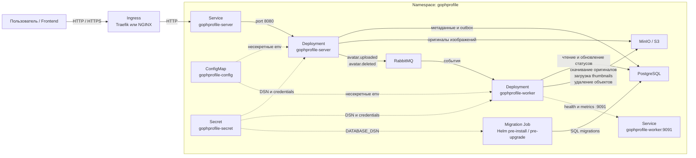
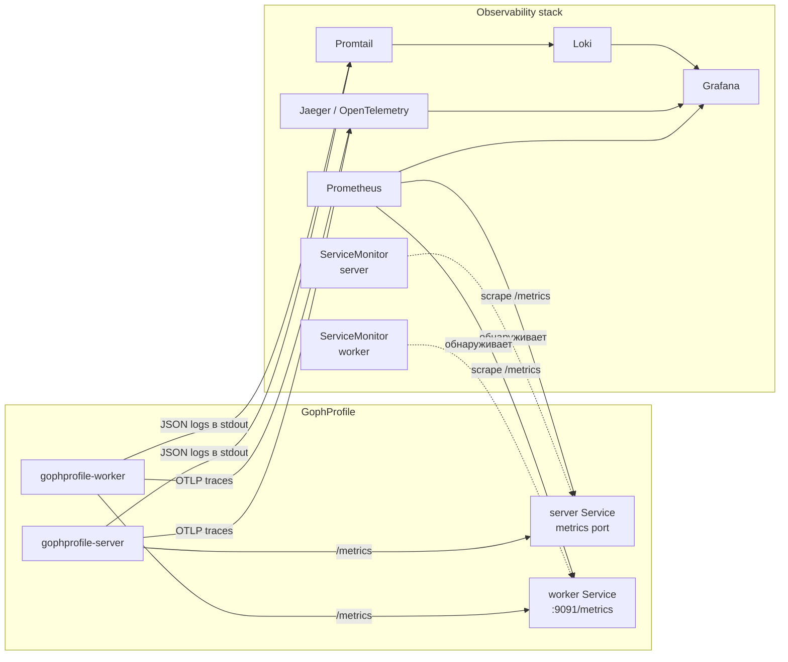
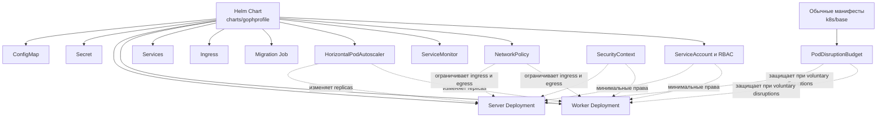

# GophProfile

GophProfile — микросервис для управления аватарками пользователей.

Сервис позволяет:

- загружать аватарку пользователя;
- получать оригинал аватарки по `avatar_id`;
- получать текущую аватарку пользователя по `user_id`;
- получать metadata аватарки;
- получать список аватарок пользователя;
- получать thumbnails `100x100` и `300x300`;
- мягко удалять аватарку;
- асинхронно обрабатывать изображения через RabbitMQ worker.

## Технологии

- Go
- Chi
- slog
- OpenTelemetry
- Jaeger
- PostgreSQL
- Goose migrations
- MinIO / S3
- RabbitMQ
- Docker Compose

## Структура проекта

```text
cmd/
  server/        HTTP-сервер
  worker/        Фоновый worker

internal/
  broker/        Работа с RabbitMQ
  config/        Конфигурация приложения
  domain/        Доменные сущности и ошибки
  handlers/      HTTP handlers и router
  logger/        slog logger
  middleware/    HTTP middleware
  repository/    PostgreSQL и S3 repositories
  services/      Бизнес-логика
  worker/        Обработчики фоновых событий

migrations/      SQL-миграции PostgreSQL
docker/          Dockerfile-ы server и worker
web/             Статические файлы
```

### Приложения

В проекте есть два отдельных Go-приложения:

| Приложение | Точка входа | Назначение |
|---|---|---|
| server | `cmd/server/main.go` | HTTP API, web-интерфейс, `/health`, `/metrics`, публикация событий через Outbox |
| worker | `cmd/worker/main.go` | Фоновая обработка событий RabbitMQ, генерация thumbnails, удаление файлов, отдельный `/metrics` endpoint |

### Docker-образы

В проекте используются отдельные Dockerfile-ы:

| Dockerfile | Что собирает |
|---|---|
| `docker/server.Dockerfile` | образ server |
| `docker/worker.Dockerfile` | образ worker |

### Docker Compose

Основной compose-файл:

```text
docker-compose.yaml


## Адреса сервисов
HTTP API	http://localhost:9090
Web upload	http://localhost:9090/web/upload
Web gallery	http://localhost:9090/web/gallery/user
PostgreSQL	localhost:5433
MinIO API	http://localhost:9000
MinIO Console	http://localhost:9001
RabbitMQ AMQP	http://localhost:5672
RabbitMQ Management UI	http://localhost:15672
Jaeger UI	http://localhost:16686
Jaeger OTLP HTTP	http://localhost:4318
Jaeger OTLP gRPC	http://localhost:4317


## Порты локального запуска

| Компонент        | URL                              |
| ---------------- | -------------------------------- |
| HTTP API         | `http://localhost:9090`          |
| Server metrics   | `http://localhost:9090/metrics`  |
| Worker metrics   | `http://localhost:9091/metrics`  |
| PostgreSQL       | `localhost:5433`                 |
| MinIO API        | `http://localhost:9000`          |
| MinIO Console    | `http://localhost:9001`          |
| RabbitMQ AMQP    | `localhost:5672`                 |
| RabbitMQ UI      | `http://localhost:15672`         |
| RabbitMQ metrics | `http://localhost:15692/metrics` |
| Jaeger UI        | `http://localhost:16686`         |
| Prometheus       | `http://localhost:9092`          |
| Alertmanager     | `http://localhost:9093`          |
| Grafana          | `http://localhost:3000`          |
| Loki             | `http://localhost:3100`          |


## Локальный запуск через Docker Compose

### Docker Compose поднимает:

PostgreSQL;
MinIO;
RabbitMQ;
goose migration;
server;
worker.

### Запуск:
``` bash
docker compose up --build -d
```

### Остановить инфраструктуру:
``` bash
docker compose down -v
```
## Проверка API
### Health check
``` bash
curl -i http://localhost:9090/health
```
#### Ожидаемый ответ:
``` bash
HTTP/1.1 200 OK
```

#### Пример тела:
``` bash
{
  "status": "ok",
  "details": {
    "postgres": "ok",
    "rabbitmq": "ok",
    "s3": "ok",
    "server": "ok"
  }
}
```
### Загрузка аватарки

#### Для PNG:
``` bash
curl -i -X POST http://localhost:9090/api/v1/avatars \
  -H "X-User-ID: user" \
  -F "file=@avatar.png;type=image/png"
```
#### Для JPEG:
``` bash
curl -i -X POST http://localhost:9090/api/v1/avatars \
  -H "X-User-ID: user" \
  -F "file=@avatar.jpg;type=image/jpeg"
```
#### Пример успешного ответа:
``` bash
{
  "id": "avatar-id",
  "user_id": "user",
  "url": "/api/v1/avatars/avatar-id",
  "status": "pending",
  "created_at": "2026-05-10T08:00:00Z"
}
```
### Проверка обработки в PostgreSQL
``` bash
docker exec -it gophprofile-postgres psql -U gophprofile -d gophprofile -c \
"select id, s3_key, width, height, thumbnail_s3_keys, processing_status from avatars order by created_at desc limit 5;"
```
#### После успешной обработки worker-ом ожидаемо:
 ``` bash
processing_status = completed
width > 0
height > 0
thumbnail_s3_keys содержит 100x100 и 300x300
```

#### Получение оригинала аватарки
``` bash
curl -sS -L http://localhost:9090/api/v1/avatars/<avatar_id> \
  --output original.jpg
  ```
#### Получение thumbnail 100x100
``` bash
curl -sS -L "http://localhost:9090/api/v1/avatars/<avatar_id>?size=100x100" \
  --output avatar_100x100.jpg
  ```
#### Получение thumbnail 300x300
``` bash
curl -sS -L "http://localhost:9090/api/v1/avatars/<avatar_id>?size=300x300" \
  --output avatar_300x300.jpg
```

### Получение metadata аватарки
``` bash
curl -i http://localhost:9090/api/v1/avatars/<avatar_id>/metadata
```
#### Пример ответа:
``` bash
{
  "id": "avatar-id",
  "user_id": "user",
  "file_name": "avatar.png",
  "mime_type": "image/png",
  "size": 12345,
  "dimensions": {
    "width": 303,
    "height": 295
  },
  "thumbnails": [
    {
      "size": "100x100",
      "url": "/api/v1/avatars/avatar-id?size=100x100"
    },
    {
      "size": "300x300",
      "url": "/api/v1/avatars/avatar-id?size=300x300"
    }
  ],
  "created_at": "2026-05-10T08:00:00Z",
  "updated_at": "2026-05-10T08:00:01Z"
}
```

### Получение текущей аватарки пользователя
``` bash
curl -sS -L http://localhost:9090/api/v1/users/user/avatar \
  --output user_current_avatar.jpg
  ```

### Получение списка аватарок пользователя
``` bash
curl -i http://localhost:9090/api/v1/users/user/avatars
```
``` bash
Пример ответа:

{
  "user_id": "user",
  "avatars": [
    {
      "id": "avatar-id",
      "user_id": "user",
      "file_name": "avatar.png",
      "mime_type": "image/png",
      "size": 12345,
      "dimensions": {
        "width": 303,
        "height": 295
      },
      "thumbnails": [
        {
          "size": "100x100",
          "url": "/api/v1/avatars/avatar-id?size=100x100"
        },
        {
          "size": "300x300",
          "url": "/api/v1/avatars/avatar-id?size=300x300"
        }
      ],
      "created_at": "2026-05-10T08:00:00Z",
      "updated_at": "2026-05-10T08:00:01Z"
    }
  ]
}
```

### Мягкое удаление аватарки по avatar_id
``` bash
curl -i -X DELETE http://localhost:9090/api/v1/avatars/<avatar_id> \
  -H "X-User-ID: user"
```
#### Ожидаемо:
``` bash
HTTP/1.1 204 No Content
```

### Удаление текущей аватарки пользователя
``` bash
curl -i -X DELETE http://localhost:9090/api/v1/users/user/avatar \
  -H "X-User-ID: user"
```
#### Ожидаемо:
``` bash
HTTP/1.1 204 No Content
```

### Проверка через браузер

#### Откройте:

http://localhost:9090/web/upload

#### Укажите:

User ID: user

#### Выберите изображение и нажмите загрузку.

#### После успешной загрузки можно открыть галерею:

http://localhost:9090/web/gallery/user


## Observability

В проекте настроен локальный observability-стек:

- structured JSON logs через `slog`;
- distributed tracing через OpenTelemetry + Jaeger;
- metrics через Prometheus;
- dashboards через Grafana;
- logs через Loki + Promtail;
- alerts через Prometheus rules + Alertmanager.

### Карта сервисов и портов

| Сервис | URL | Назначение |
|---|---|---|
| GophProfile API | http://localhost:9090 | HTTP API сервиса |
| Server metrics | http://localhost:9090/metrics | Prometheus metrics server-а |
| Worker metrics | http://localhost:9091/metrics | Prometheus metrics worker-а |
| Prometheus | http://localhost:9092 | Метрики и alerts |
| Alertmanager | http://localhost:9093 | Просмотр alert-ов |
| Grafana | http://localhost:3000 | Dashboards, logs, metrics |
| Jaeger | http://localhost:16686 | Distributed traces |
| Loki | http://localhost:3100 | Хранилище логов |
| RabbitMQ UI | http://localhost:15672 | RabbitMQ Management UI |
| RabbitMQ metrics | http://localhost:15692/metrics | RabbitMQ Prometheus metrics |
| MinIO API | http://localhost:9000 | S3-compatible API |
| MinIO Console | http://localhost:9001 | Web UI MinIO |
| MinIO metrics | http://localhost:9000/minio/v2/metrics/cluster | MinIO Prometheus metrics |
| PostgreSQL exporter | http://localhost:9187/metrics | PostgreSQL Prometheus metrics |

### Запуск

```bash
docker compose up -d --build
```

Проверить контейнеры:

```bash
docker compose ps
```

Проверить API:

```bash
curl -i http://localhost:9090/health
```

Проверить server metrics:

```bash
curl -i http://localhost:9090/metrics
```

Проверить worker metrics:

```bash
curl -i http://localhost:9091/metrics
```

Проверить Loki:

```bash
curl -i http://localhost:3100/ready
```

Проверить Alertmanager:

```bash
curl -i http://localhost:9093/-/ready
```

### Тестовый upload

```bash
curl -i -X POST http://localhost:9090/api/v1/avatars \
  -H "X-User-ID: user" \
  -F "file=@avatar.jpeg"
```

В ответе должен быть `id` аватарки и trace header:

```text
X-Trace-Id: ...
```

Пример получения аватарки:

```bash
curl -i http://localhost:9090/api/v1/avatars/<avatar_id>
```

Пример удаления:

```bash
curl -i -X DELETE http://localhost:9090/api/v1/avatars/<avatar_id> \
  -H "X-User-ID: user"
```

---

## Logs

Логи server-а и worker-а пишутся в JSON-формате через `slog`.

Основные поля:

```text
time
level
msg
service
environment
component
operation
error
user_id
avatar_id
trace_id
span_id
```

Promtail собирает Docker-логи контейнеров:

```text
gophprofile-server
gophprofile-worker
```

и отправляет их в Loki.

### LogQL-запросы

Открыть Grafana:

```text
http://localhost:3000
```

Дальше:

```text
Explore -> Loki
```

Все логи server-а:

```logql
{service="gophprofile-server"}
```

Все логи worker-а:

```logql
{service="gophprofile-worker"}
```

Ошибки server-а:

```logql
{service="gophprofile-server", level="ERROR"}
```

Ошибки worker-а:

```logql
{service="gophprofile-worker", level="ERROR"}
```

Логи с trace ID:

```logql
{service="gophprofile-server"} |= "trace_id"
```

Логи по конкретному avatar ID:

```logql
{service="gophprofile-server"} |= "<avatar_id>"
```

Логи конкретной операции:

```logql
{service="gophprofile-server"} |= "http.get_avatar"
```

```logql
{service="gophprofile-worker"} |= "worker.process_avatar_uploaded"
```

---

## Tracing

Tracing реализован через OpenTelemetry.

Server и worker отправляют traces в Jaeger через OTLP HTTP endpoint:

```text
jaeger:4318
```

Jaeger UI:

```text
http://localhost:16686
```

Основные spans:

```text
HTTP:
  GET /health
  POST /api/v1/avatars
  GET /api/v1/avatars/{avatar_id}
  DELETE /api/v1/avatars/{avatar_id}

AvatarService:
  avatar_service.upload_avatar
  avatar_service.get_avatar_by_id
  avatar_service.get_avatar_thumbnail_by_id
  avatar_service.get_avatar_metadata
  avatar_service.list_avatars_by_user_id
  avatar_service.delete_avatar_by_id

PostgreSQL:
  postgres.avatar.create_with_upload_event
  postgres.avatar.get_by_id
  postgres.avatar.list_by_user_id
  postgres.avatar.soft_delete_with_delete_event

S3/MinIO:
  s3.upload
  s3.download
  s3.delete
  s3.exists

RabbitMQ:
  rabbitmq.publish
  rabbitmq.consume

Worker:
  worker.process_avatar_uploaded
  worker.generate_thumbnails
  worker.process_avatar_deleted
```

### Проверка trace

Сделать запрос:

```bash
curl -i http://localhost:9090/health
```

В ответе должен быть заголовок:

```text
X-Trace-Id: ...
```

Открыть Jaeger:

```text
http://localhost:16686
```

Выбрать service:

```text
gophprofile-server
```

Нажать:

```text
Find Traces
```

### Корреляция logs -> traces

Loki datasource настроен с derived field `TraceID`.

Сценарий:

1. Открыть Grafana.
2. Перейти в `Explore -> Loki`.
3. Выполнить запрос:

```logql
{service="gophprofile-server"} |= "trace_id"
```

4. Раскрыть строку лога.
5. Нажать на derived field `TraceID`.
6. Grafana откроет соответствующий trace через Jaeger datasource.

---

## Metrics

Метрики собирает Prometheus:

```text
http://localhost:9092
```

Targets:

```text
server:8080/metrics
worker:9091/metrics
rabbitmq:15692/metrics
rabbitmq:15692/metrics/detailed
postgres-exporter:9187/metrics
minio:9000/minio/v2/metrics/cluster
minio:9000/minio/v2/metrics/bucket
minio:9000/minio/v2/metrics/node
```

Проверка targets:

```text
http://localhost:9092/targets
```

Все targets должны быть `UP`.

### Основные PromQL-запросы

Targets:

```promql
up
```

HTTP request rate:

```promql
sum by (method, route, status) (rate(gophprofile_http_requests_total[5m]))
```

HTTP 5xx error rate:

```promql
sum(rate(gophprofile_http_requests_total{status=~"5.."}[5m]))
```

HTTP p95 latency:

```promql
histogram_quantile(
  0.95,
  sum by (le, route) (rate(gophprofile_http_request_duration_seconds_bucket[5m]))
)
```

Avatar uploads:

```promql
gophprofile_avatars_uploads_total
```

Avatar upload errors:

```promql
sum(rate(gophprofile_avatars_uploads_total{status="error"}[5m]))
```

Avatar processing:

```promql
gophprofile_avatars_processing_total
```

Avatar processing errors:

```promql
rate(gophprofile_avatars_processing_errors_total[5m])
```

Worker messages:

```promql
gophprofile_worker_messages_consumed_total
```

Worker failures:

```promql
gophprofile_worker_messages_failed_total
```

RabbitMQ queue depth:

```promql
rabbitmq_detailed_queue_messages{queue=~"avatar\\.(uploaded|deleted)\\.queue"}
```

RabbitMQ ready messages:

```promql
rabbitmq_detailed_queue_messages_ready{queue=~"avatar\\.(uploaded|deleted)\\.queue"}
```

RabbitMQ unacked messages:

```promql
rabbitmq_detailed_queue_messages_unacked{queue=~"avatar\\.(uploaded|deleted)\\.queue"}
```

RabbitMQ consumers:

```promql
rabbitmq_detailed_queue_consumers{queue=~"avatar\\.(uploaded|deleted)\\.queue"}
```

PostgreSQL status:

```promql
pg_up
```

PostgreSQL connections:

```promql
pg_stat_database_numbackends{datname="gophprofile"}
```

PostgreSQL DB size:

```promql
pg_database_size_bytes{datname="gophprofile"}
```

MinIO status:

```promql
up{service="minio"}
```

MinIO bucket storage:

```promql
minio_bucket_usage_total_bytes
```

MinIO bucket objects:

```promql
minio_bucket_usage_object_total
```

---

## Grafana dashboards

Grafana доступна по адресу:

```text
http://localhost:3000
```

Логин/пароль по умолчанию:

```text
admin / admin
```

Dashboards загружаются автоматически через provisioning.

### Доступные dashboards

```text
GophProfile / GophProfile Service Overview
GophProfile / GophProfile Worker & Queue
GophProfile / GophProfile Business KPIs
GophProfile / GophProfile Infrastructure
```

### Service Overview

Показывает:

```text
request rate
error rate
p95 latency
uploads total
upload errors
worker processed messages
worker failed messages
storage usage
active worker jobs
deleted avatars
```

### Worker & Queue

Показывает:

```text
RabbitMQ queue depth
RabbitMQ messages ready
RabbitMQ messages unacked
RabbitMQ consumers
worker processing rate
worker failed messages
worker processing duration p95
worker active jobs
worker retries
```

### Business KPIs

Показывает:

```text
successful uploads
upload errors
deleted avatars
storage usage
avatar processing statuses
processing errors
processing duration p95
upload success ratio
```

### Infrastructure

Показывает:

```text
Prometheus targets status
PostgreSQL health, connections, DB size, transaction rate
RabbitMQ queue depth, ready/unacked messages, consumers
MinIO bucket storage, objects, request rate, error rate, capacity usage
```

---

## Alerts

Prometheus rules находятся в:

```text
deploy/prometheus/rules/gophprofile-alerts.yml
```

Alertmanager config:

```text
deploy/alertmanager/alertmanager.yml
```

Alertmanager UI:

```text
http://localhost:9093
```

Prometheus pages:

```text
http://localhost:9092/alerts
http://localhost:9092/rules
```

На текущем этапе используется `noop` receiver: алерты видны в Alertmanager UI, но не отправляются во внешние каналы.

### Пример проверки alert-а

Остановить worker:

```bash
docker compose stop worker
```

Через 1–2 минуты проверить:

```text
http://localhost:9092/alerts
http://localhost:9093
```

Вернуть worker:

```bash
docker compose start worker
```

---

## Диагностика сценария: 500 ошибка -> log -> trace -> metrics

### 1. Получить 500

Например, временно остановить MinIO:

```bash
docker compose stop minio
```

Запросить существующую аватарку:

```bash
curl -i http://localhost:9090/api/v1/avatars/<avatar_id>
```

Вернуть MinIO:

```bash
docker compose start minio
```

В ответе будет:

```text
HTTP/1.1 500 Internal Server Error
X-Trace-Id: ...
```

### 2. Найти лог ошибки

Открыть Grafana:

```text
http://localhost:3000
```

Перейти:

```text
Explore -> Loki
```

Запрос:

```logql
{service="gophprofile-server", level="ERROR"} |= "<avatar_id>"
```

В логе должны быть поля:

```text
component
operation
error
avatar_id
trace_id
span_id
```

### 3. Перейти из лога в trace

В раскрытой строке лога нажать derived field:

```text
TraceID
```

Grafana откроет trace в Jaeger datasource.

Если переход не сработал, можно вручную открыть:

```text
http://localhost:16686
```

И найти trace по `trace_id`.

### 4. Проверить метрики

HTTP 5xx:

```promql
sum(rate(gophprofile_http_requests_total{status=~"5.."}[5m]))
```

Ошибки upload:

```promql
sum(rate(gophprofile_avatars_uploads_total{status="error"}[5m]))
```

Ошибки worker-а:

```promql
sum(rate(gophprofile_worker_messages_failed_total[5m]))
```

Ошибки обработки аватарок:

```promql
rate(gophprofile_avatars_processing_errors_total[5m])
```

Состояние MinIO:

```promql
up{service="minio"}
```

### 5. Проверить dashboards

Открыть Grafana dashboards:

```text
GophProfile Service Overview
GophProfile Business KPIs
GophProfile Infrastructure
```

Проверить:

```text
HTTP error rate
p95 latency
MinIO target status
avatar processing errors
```

---

## Быстрые команды диагностики

Server logs:

```bash
docker logs gophprofile-server --tail=100
```

Worker logs:

```bash
docker logs gophprofile-worker --tail=100
```

Server metrics:

```bash
curl -s http://localhost:9090/metrics | grep gophprofile_http
```

Worker metrics:

```bash
curl -s http://localhost:9091/metrics | grep gophprofile_worker
```

Prometheus targets:

```bash
curl -s http://localhost:9092/api/v1/targets | grep health
```

Loki ready:

```bash
curl -i http://localhost:3100/ready
```

Alertmanager ready:

```bash
curl -i http://localhost:9093/-/ready
```

### OpenSearch API:
```bash
http://localhost:9200
```
### OpenSearch Dashboards:
```bash
http://localhost:5601
```


## Сборка Docker-образов для Kubernetes

Server и worker собираются отдельными Dockerfile-ами:

```bash
docker build -f docker/server.Dockerfile -t gophprofile-server:local .
docker build -f docker/worker.Dockerfile -t gophprofile-worker:local .
```

Проверка:

```bash
docker images | grep gophprofile
```

Эти локальные tags используются в Kubernetes-манифестах для dev-запуска.


## OpenAPI и Swagger UI

Актуальная OpenAPI-спецификация GophProfile находится в файле:

```text
docs/openapi.yaml
```

Она описывает:

* загрузку аватарки;
* получение оригинала и thumbnails;
* получение метаданных;
* список аватарок пользователя;
* удаление аватарок;
* `/live`, `/ready` и `/health`;
* Prometheus endpoint `/metrics`.

Запуск Swagger UI:

```bash
docker run --rm \
  --name gophprofile-swagger-ui \
  -p 8081:8080 \
  -e SWAGGER_JSON=/app/openapi.yaml \
  -v "$(pwd)/docs/openapi.yaml:/app/openapi.yaml:ro" \
  swaggerapi/swagger-ui
```

После запуска Swagger UI доступен по адресу:

```text
http://localhost:8081
```

Для выполнения защищённых запросов через Swagger UI нужно нажать `Authorize` и указать значение заголовка `X-User-ID`.
# Архитектура GophProfile в Kubernetes

Этот документ описывает целевую архитектуру GophProfile при развёртывании в Kubernetes.

Приложение состоит из двух основных процессов:

- `server` — принимает HTTP-запросы пользователей;
- `worker` — асинхронно обрабатывает события из RabbitMQ.

Server и worker разворачиваются как отдельные Kubernetes Deployment, потому что у них разные роли, порты, probes, ресурсы и правила масштабирования.

## Основной поток данных



## Как проходит загрузка аватарки

1. Пользователь отправляет `POST /api/v1/avatars`.
2. Ingress направляет запрос в Service `gophprofile-server`.
3. Service выбирает готовый Pod server.
4. Server сохраняет оригинал изображения в MinIO.
5. Server сохраняет метаданные и outbox-событие в PostgreSQL.
6. Outbox dispatcher публикует событие `avatar.uploaded` в RabbitMQ.
7. Worker получает событие.
8. Worker скачивает оригинал из MinIO.
9. Worker создаёт thumbnails `100x100` и `300x300`.
10. Worker загружает thumbnails в MinIO.
11. Worker обновляет статус и пути thumbnails в PostgreSQL.

Удаление работает похожим образом:

1. Server выполняет soft delete записи в PostgreSQL.
2. Server публикует событие `avatar.deleted`.
3. Worker удаляет оригинал и thumbnails из MinIO.

## Наблюдаемость



Server отдаёт метрики на endpoint:

```text
/metrics
```

Worker отдаёт метрики на отдельном HTTP-порту:

```text
:9091/metrics
```

ServiceMonitor используется только в кластере с установленным Prometheus Operator и CRD:

```text
servicemonitors.monitoring.coreos.com
```

В локальном Rancher Desktop ServiceMonitor выключен, потому что эта CRD пока не установлена.

Трассировка server и worker связывается через передачу OpenTelemetry context в заголовках RabbitMQ-сообщений.

JSON-логи содержат:

- `service`;
- `component`;
- `operation`;
- `trace_id`;
- `span_id`;
- `error`.

Это позволяет связать логи Loki с трассами Jaeger.

## Kubernetes-ресурсы управления



## Масштабирование

Server и worker масштабируются независимо.

### Server

HPA server использует:

- CPU;
- memory;
- минимальное и максимальное количество реплик.

Server обрабатывает пользовательский HTTP-трафик, поэтому его масштабирование зависит от нагрузки на API.

### Worker

Worker базово масштабируется по CPU.

В дальнейшем его можно масштабировать по глубине очереди RabbitMQ через KEDA или external metrics.

## Безопасность

Для server и worker используются:

- отдельный ServiceAccount;
- Role с минимальными правами;
- `automountServiceAccountToken: false`;
- `runAsNonRoot: true`;
- `allowPrivilegeEscalation: false`;
- удаление всех Linux capabilities;
- `readOnlyRootFilesystem: true`;
- `RuntimeDefault` seccomp profile;
- writable `emptyDir` только для `/tmp`;
- NetworkPolicy для ограничения входящего и исходящего трафика.

## Graceful Shutdown

При остановке Pod Kubernetes отправляет процессу `SIGTERM`.

Server:

1. перестаёт принимать новые HTTP-запросы;
2. завершает текущие запросы через `http.Server.Shutdown`;
3. закрывает подключения к PostgreSQL, RabbitMQ и другим ресурсам.

Worker:

1. перестаёт получать новые сообщения;
2. завершает уже начатую обработку;
3. выполняет `ack` или `nack`;
4. закрывает RabbitMQ consumer;
5. останавливает metrics-server.

Для server и worker также настроены:

- `terminationGracePeriodSeconds`;
- rolling update strategy;
- PodDisruptionBudget.

## Локальное и production-окружение

### Локальный Rancher Desktop

Для локальной разработки PostgreSQL, RabbitMQ и MinIO разворачиваются из:

```text
k8s/dev/
```

Эти манифесты предназначены только для разработки.

### Production

В production PostgreSQL, RabbitMQ и S3 могут быть внешними управляемыми сервисами.

Их адреса и credentials должны передаваться через:

- Helm values;
- Kubernetes Secret;
- CI/CD;
- External Secrets;
- другой внешний secret manager.

Реальные секреты нельзя хранить в Git.

## Способы развёртывания

В проекте остаются два способа развёртывания.

### Обычные Kubernetes-манифесты

```text
k8s/base/
k8s/dev/
```

Они подходят для изучения Kubernetes и ручного запуска через `kubectl`.

### Helm Chart

```text
charts/gophprofile/
```

Helm Chart является основным способом установки, обновления и настройки приложения для разных окружений.


## Документация

- [OpenAPI-спецификация](docs/openapi.yaml)
- [Архитектура GophProfile в Kubernetes](docs/architecture-k8s.md)
- [Kubernetes-манифесты](k8s/README.md)
- [Helm Chart](charts/gophprofile/README.md)
- [Развёртывание GophProfile через Helm](docs/helm.md)


### Kubernetes

Пошаговая инструкция по развёртыванию GophProfile через `kubectl` находится в документе:

* [Kubernetes-манифесты и руководство по деплою](k8s/README.md)

Инструкция включает:

* подготовку Rancher Desktop;
* сборку локальных Docker-образов;
* создание namespace, ConfigMap и Secret;
* запуск PostgreSQL, RabbitMQ и MinIO;
* выполнение миграций;
* запуск server и worker;
* настройку Ingress, HPA, PDB и NetworkPolicy;
* проверку health, metrics и загрузки аватарки;
* команды диагностики и очистки окружения.
