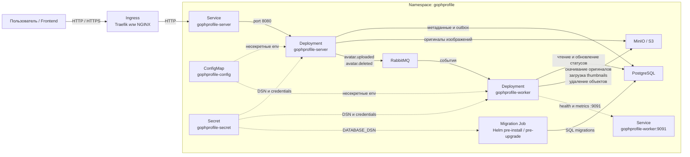
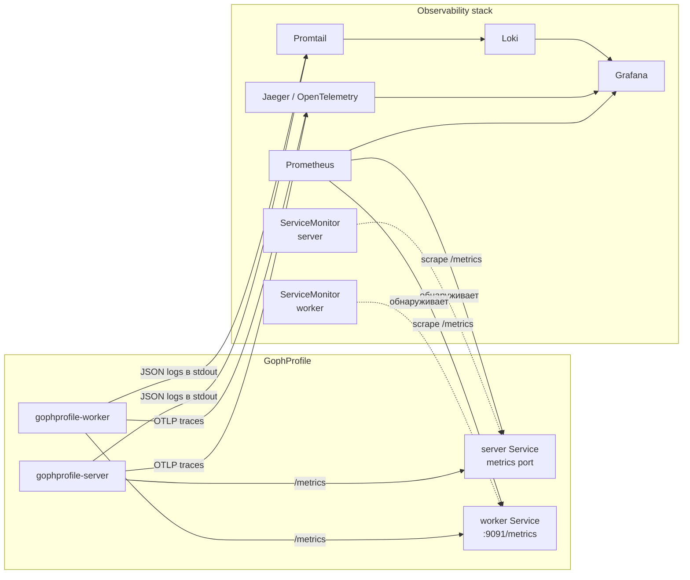

# Архитектура GophProfile в Kubernetes

Этот документ описывает целевую архитектуру GophProfile при развёртывании в Kubernetes.

Приложение состоит из двух основных процессов:

- `server` — принимает HTTP-запросы пользователей;
- `worker` — асинхронно обрабатывает события из RabbitMQ.

Server и worker разворачиваются как отдельные Kubernetes Deployment, потому что у них разные роли, порты, probes, ресурсы и правила масштабирования.

## Основной поток данных



## Как проходит загрузка аватарки

1. Пользователь отправляет `POST /api/v1/avatars`.
2. Ingress направляет запрос в Service `gophprofile-server`.
3. Service выбирает готовый Pod server.
4. Server сохраняет оригинал изображения в MinIO.
5. Server сохраняет метаданные и outbox-событие в PostgreSQL.
6. Outbox dispatcher публикует событие `avatar.uploaded` в RabbitMQ.
7. Worker получает событие.
8. Worker скачивает оригинал из MinIO.
9. Worker создаёт thumbnails `100x100` и `300x300`.
10. Worker загружает thumbnails в MinIO.
11. Worker обновляет статус и пути thumbnails в PostgreSQL.

Удаление работает похожим образом:

1. Server выполняет soft delete записи в PostgreSQL.
2. Server публикует событие `avatar.deleted`.
3. Worker удаляет оригинал и thumbnails из MinIO.

## Наблюдаемость



Server отдаёт метрики на endpoint:

```text
/metrics
```

Worker отдаёт метрики на отдельном HTTP-порту:

```text
:9091/metrics
```

ServiceMonitor используется только в кластере с установленным Prometheus Operator и CRD:

```text
servicemonitors.monitoring.coreos.com
```

В локальном Rancher Desktop ServiceMonitor выключен, потому что эта CRD пока не установлена.

Трассировка server и worker связывается через передачу OpenTelemetry context в заголовках RabbitMQ-сообщений.

JSON-логи содержат:

- `service`;
- `component`;
- `operation`;
- `trace_id`;
- `span_id`;
- `error`.

Это позволяет связать логи Loki с трассами Jaeger.

## Kubernetes-ресурсы управления

```mermaid
flowchart TB
    Helm["Helm Chart<br/>charts/gophprofile"]

    Config["ConfigMap"]
    Secret["Secret"]
    Server["Server Deployment"]
    Worker["Worker Deployment"]
    Services["Services"]
    Ingress["Ingress"]
    Migration["Migration Job"]
    HPA["HorizontalPodAutoscaler"]
    PDB["PodDisruptionBudget"]
    ServiceMonitor["ServiceMonitor"]
    NetworkPolicy["NetworkPolicy"]
    RBAC["ServiceAccount и RBAC"]
    SecurityContext["SecurityContext"]

    Helm --> Config
    Helm --> Secret
    Helm --> Server
    Helm --> Worker
    Helm --> Services
    Helm --> Ingress
    Helm --> Migration
    Helm --> HPA
    Helm --> PDB
    Helm --> ServiceMonitor
    Helm --> NetworkPolicy
    Helm --> RBAC

    SecurityContext -.-> Server
    SecurityContext -.-> Worker

    HPA -.->|"изменяет replicas"| Server
    HPA -.->|"изменяет replicas"| Worker

    PDB -.->|"защищает при voluntary disruptions"| Server
    PDB -.->|"защищает при voluntary disruptions"| Worker

    RBAC -.->|"минимальные права"| Server
    RBAC -.->|"минимальные права"| Worker

    NetworkPolicy -.->|"ограничивает ingress и egress"| Server
    NetworkPolicy -.->|"ограничивает ingress и egress"| Worker
```



## Масштабирование

Server и worker масштабируются независимо.

### Server

HPA server использует:

- CPU;
- memory;
- минимальное и максимальное количество реплик.

Server обрабатывает пользовательский HTTP-трафик, поэтому его масштабирование зависит от нагрузки на API.

### Worker

Worker базово масштабируется по CPU.

В дальнейшем его можно масштабировать по глубине очереди RabbitMQ через KEDA или external metrics.

## Безопасность

Для server и worker используются:

- отдельный ServiceAccount;
- Role с минимальными правами;
- `automountServiceAccountToken: false`;
- `runAsNonRoot: true`;
- `allowPrivilegeEscalation: false`;
- удаление всех Linux capabilities;
- `readOnlyRootFilesystem: true`;
- `RuntimeDefault` seccomp profile;
- writable `emptyDir` только для `/tmp`;
- NetworkPolicy для ограничения входящего и исходящего трафика.

## Graceful Shutdown

При остановке Pod Kubernetes отправляет процессу `SIGTERM`.

Server:

1. перестаёт принимать новые HTTP-запросы;
2. завершает текущие запросы через `http.Server.Shutdown`;
3. закрывает подключения к PostgreSQL, RabbitMQ и другим ресурсам.

Worker:

1. перестаёт получать новые сообщения;
2. завершает уже начатую обработку;
3. выполняет `ack` или `nack`;
4. закрывает RabbitMQ consumer;
5. останавливает metrics-server.

Для server и worker также настроены:

- `terminationGracePeriodSeconds`;
- rolling update strategy;
- PodDisruptionBudget.

## Локальное и production-окружение

### Локальный Rancher Desktop

Для локальной разработки PostgreSQL, RabbitMQ и MinIO разворачиваются из:

```text
k8s/dev/
```

Эти манифесты предназначены только для разработки.

### Production

В production PostgreSQL, RabbitMQ и S3 могут быть внешними управляемыми сервисами.

Их адреса и credentials должны передаваться через:

- Helm values;
- Kubernetes Secret;
- CI/CD;
- External Secrets;
- другой внешний secret manager.

Реальные секреты нельзя хранить в Git.

## Способы развёртывания

В проекте остаются два способа развёртывания.

### Обычные Kubernetes-манифесты

```text
k8s/base/
k8s/dev/
```

Они подходят для изучения Kubernetes и ручного запуска через `kubectl`.

### Helm Chart

```text
charts/gophprofile/
```

Helm Chart является основным способом установки, обновления и настройки приложения для разных окружений.
